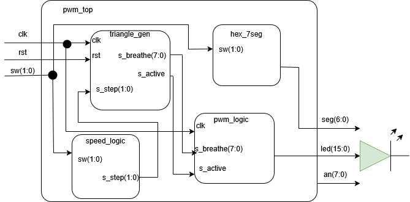

# Repozitár projektu z predmetu BPC-DE1 25/26L fakulty FEKT VUT

Autori:
- [Daniel Kubica](https://github.com/danielkubica) 
- [Adam Koutný](https://github.com/AdamRaccoon)

## Úloha
Create a module that smoothly changes LED brightness by generating a triangle waveform for the PWM duty cycle, simulating “inhale” and “exhale.”

# Breathing LED Controller (PWM)

Cílem tohoto projektu je vytvořit vizuální efekt „dýchání“ implementovaný na vývojové desce Nexys A7-50T. Projekt využívá pulzně šířkovou modulaci (PWM) k plynulé změně jasu všech 16 integrovaných LED diod.

### Hlavní funkce projektu:

* **Plynulé dýchání (Triangle Wave):** Jas LED diod se mění podle trojúhelníkového signálu, což simuluje přirozený cyklus nádechu a výdechu.
* **Prostorová gradace:** Intenzita jasu není na všech LED stejná; maximální hodnota jasu se postupně zvyšuje směrem ke středu LED lišty (LED 7 a 8 svítí nejvíce).
* **Nastavitelná rychlost:** Pomocí dvou přepínačů (switches) lze měnit rychlost dýchání ve čtyřech úrovních (0× až 3×).
* **Vizuální zpětná vazba:** Aktuálně zvolený násobič rychlosti je v reálném čase zobrazován na sedmisegmentovém displeji.

---

### Ovládání a parametry:

Uživatelské rozhraní je navrženo pro maximální jednoduchost s využitím prvků přímo na desce:

| Prvek | Funkce | Popis |
| :--- | :--- | :--- |
| **Switches [1:0]** | Nastavení rychlosti | 2-bitové číslo (0–3) určující rychlost cyklu. |
| **LED [15:0]** | Výstupní signál | Všech 16 LED diod zobrazuje efekt dýchání. |
| **7-seg displej** | Indikátor | Zobrazuje aktuální stav (0 = vypnuto, 1, 2, 3). |

---

### Technické detaily:

* **PWM frekvence:** Optimalizována pro plynulý přechod bez viditelného blikání.
* **Logika rychlosti:** * `00`: Efekt je zastaven (vypnuto).
  * `01`: Základní rychlost (1×).
  * `10`: Dvojnásobná rychlost (2×).
  * `11`: Trojnásobná rychlost (3×).
* **Implementace:** Vytvořeno v jazyce VHDL pro FPGA Artix-7 (Nexys A7-50T/100T).

---

### Jak projekt zprovoznit:
1. Nahrajte zdrojový soubor `.v` do prostředí **Xilinx Vivado**.
2. Připojte příslušný `.xdc` soubor s definicí pinů pro Nexys A7.
3. Proveďte syntézu, implementaci a generování bitstreamu.
4. Nahrajte program do desky a pomocí prvních dvou switchů ovládejte rychlost.
## Blokový diagram

## Simulácie
:TODO

## Poster, atď
:TODO